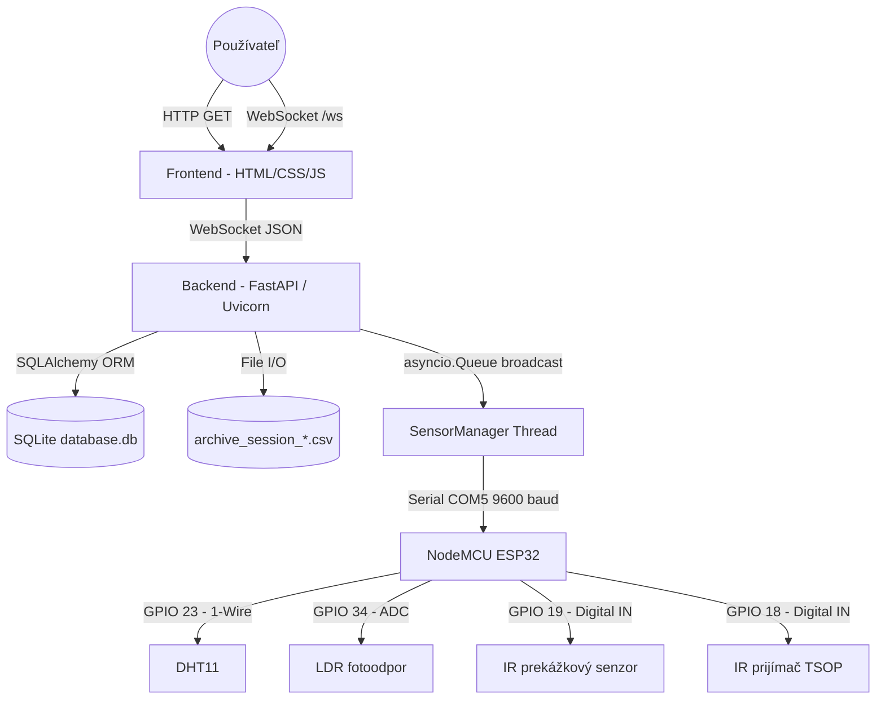
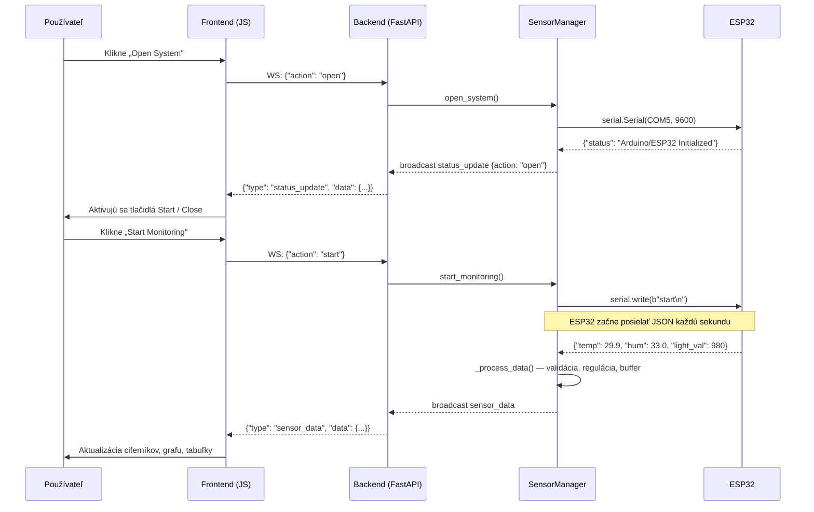
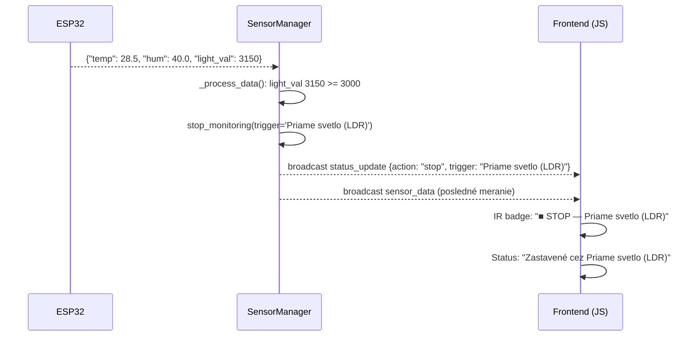
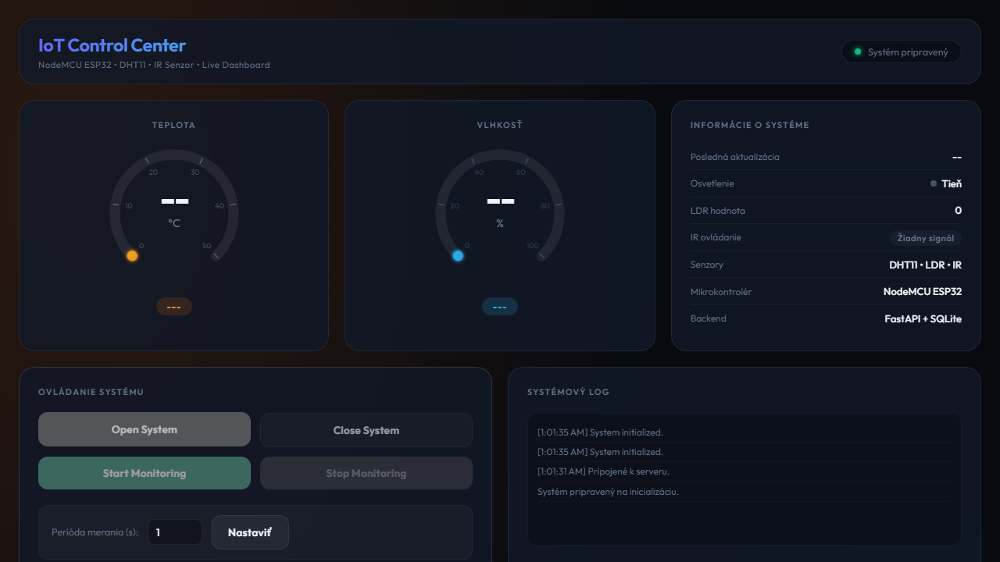
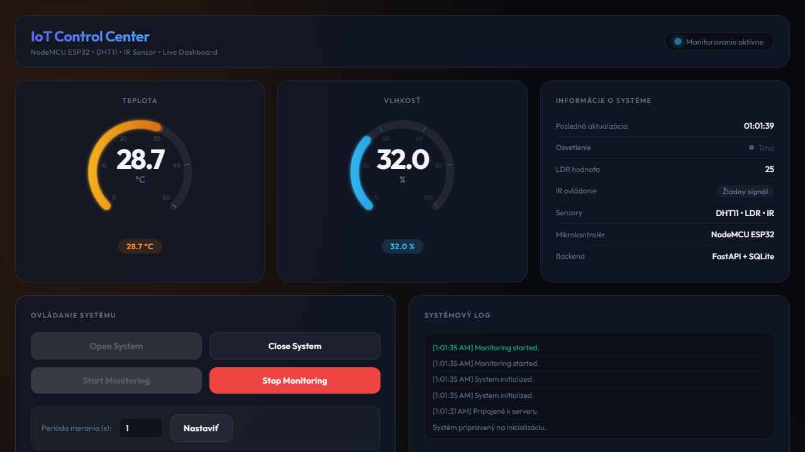
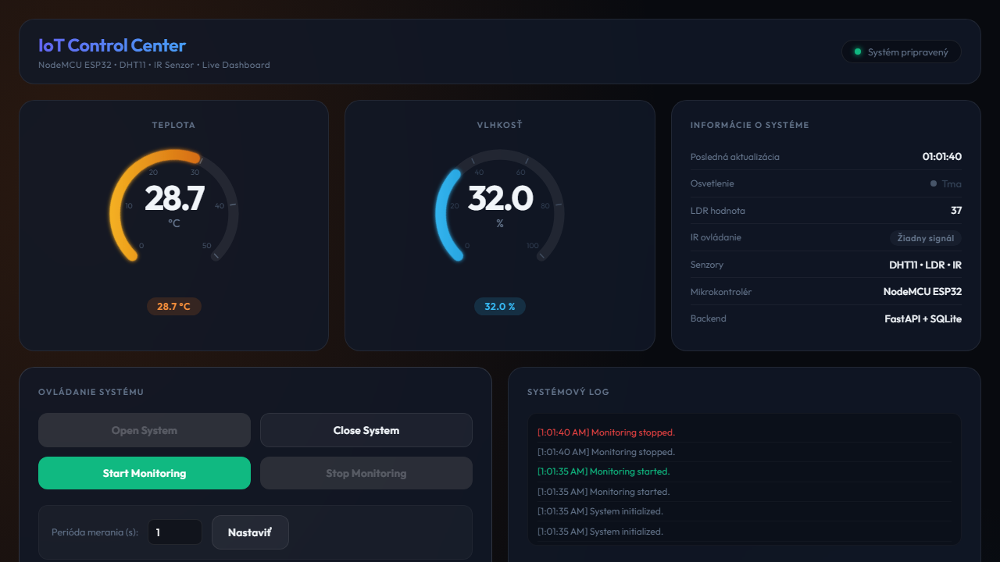

# Technická dokumentácia — IoT Control Center

**Predmet:** POIT — Programovanie a ovládanie IoT systémov  
**Autor:** Michal Havryliuk  
**Verzia:** 3.0  
**Dátum:** 4. jún 2026  
**Repozitár:** https://github.com/HavryliukM/POIT  

---

## 1. Úvod a cieľ projektu

Cieľom projektu **IoT Control Center** je návrh a realizácia komplexnej webovej aplikácie pre real-time monitorovanie senzorických dát v prostredí IoT (Internet of Things). Systém je postavený na mikrokontroléri **NodeMCU ESP32**, ku ktorému sú pripojené reálne senzory:

- **Senzor teploty a vlhkosti DHT11** — DHT11 na doske s LED + kábliky (#VST7991)
- **Nepájivé pole** 400 bodov (#DPS174)
- **Vývojová doska** NODE MCU ESP32 WiFi + Bluetooth - Áno (#IOT7551), naspájkované piny
- **Kábliky** 40 kusov 10 cm M-M (#KAB999)
- **Rezistor** 10K ohm 1/4W z balenia (#ICS36904)
- **Fotorezistor** GL5528 (#ICS944)
- **Infračervený prijímač** VS1838 (#VST319)
- **Infračervený senzor prekážok** TCRT5000 (#VST884)

Aplikácia spĺňa všetkých **10 bodov zadania** — od inicializácie (Open) cez nastavenie parametrov, spustenie monitorovania (Start), zobrazovanie dát (zoznamy, grafy, ciferníky), archiváciu (DB, CSV), až po zastavenie (Stop) a ukončenie (Close). Systém implementuje aj nadštandardné funkcie: automatické zastavenie pri detekcii priameho svetla, 5-stupňovú klasifikáciu osvetlenia, simulačný režim bez hardvéru a manuálne riadenie archívu.

---

## 2. Architektúra systému

### 2.1 Trojvrstvová architektúra

Systém je rozdelený do troch logických vrstiev:

**Hardvérová vrstva (ESP32)**  
Riadiaci mikrokontrolér zbiera dáta zo senzorov a komunikuje s Python backendom cez **sériovú linku USB (Serial, 9600 baud)** vo formáte **JSON**. Implementuje debouncing (250 ms) pre IR prekážkový senzor, príjem IR kódov cez knižnicu IRremote a odosielanie nameraných hodnôt vo voliteľnom intervale.

**Serverová vrstva (Backend)**  
Postavená na frameworku **FastAPI** (Python 3.x). Riadi životný cyklus systému (Open/Close/Start/Stop), číta sériovú linku v démonickom vlákne, spracúva a validuje dáta, broadcastuje ich všetkým pripojeným WebSocket klientom, vykonáva reguláciu (akčný člen) a spravuje archiváciu (SQLite + CSV).

**Prezentačná vrstva (Frontend)**  
Moderný **SPA dashboard** na čistom HTML5, CSS3 a Vanilla JavaScript (ES6+). Komunikuje so serverom cez WebSocket, vykresluje animované SVG ciferníky, dual-axis Chart.js graf a interaktívne tabuľky. Umožňuje manuálne ukladanie a načítanie archívnych relácií.

### 2.2 Diagram komponentov



### 2.3 Sekvenčný diagram — spustenie merania



### 2.4 Sekvenčný diagram — automatické zastavenie pri svetle



---

## 3. Komunikačný protokol

### 3.1 Sériová linka ESP32 ↔ Python (9600 baud, JSON lines)

**ESP32 → Backend — senzorové dáta:**
```json
{"temp": 29.70, "hum": 33.00, "light_val": 980}
```

| Pole | Typ | Rozsah | Popis |
|:---|:---|:---|:---|
| `temp` | float | -10 – 60 °C | Teplota z DHT11 |
| `hum` | float | 0 – 100 % | Relatívna vlhkosť z DHT11 |
| `light_val` | int | 0 – 4095 | Surová 12-bit ADC hodnota LDR |

> **Poznámka:** Pole `light` (0/1) bolo z ESP32 firmware odstránené — binárna kategorizácia sa vykonáva na serverovej strane z hodnoty `light_val`.

**ESP32 → Backend — IR udalosti:**
```json
{"action": "start", "trigger": "IR prekážkový senzor"}
{"action": "stop",  "trigger": "IR diaľkový ovládač"}
{"action": "start", "trigger": "Web UI"}
```

**ESP32 → Backend — chyba senzora:**
```json
{"error": "Failed to read from DHT sensor!"}
```

**Backend → ESP32 — príkazy:**
```
start\n
stop\n
interval:2000\n
```

### 3.2 WebSocket protokol Frontend ↔ Backend

**Klient → Server (akcie):**
```json
{"action": "open"}
{"action": "close"}
{"action": "start"}
{"action": "stop"}
{"action": "set_params", "interval": 2.0}
```

**Server → Klient — telemetria (sensor_data):**
```json
{
  "type": "sensor_data",
  "data": {
    "timestamp": "2026-06-04 00:05:09",
    "temp": 29.70,
    "hum": 33.00,
    "light": 0,
    "light_val": 980
  }
}
```

**Server → Klient — stav systému (status_update):**
```json
{
  "type": "status_update",
  "data": {
    "action": "stop",
    "message": "Monitoring stopped.",
    "trigger": "IR prekážkový senzor",
    "isRunning": false,
    "isOpen": true
  }
}
```

**Server → Klient — potvrdenie akcie (response):**
```json
{
  "type": "response",
  "data": {
    "status": "success",
    "message": "Monitoring started."
  }
}
```

### 3.3 REST API

| Metóda | Endpoint | Popis |
|:---|:---|:---|
| `GET` | `/` | Dashboard (HTML) |
| `GET` | `/api/history` | Posledných 50 meraní z DB (JSON) |
| `GET` | `/api/archive/load_db?id=<n>` | Načíta uloženú reláciu z DB podľa ID |
| `GET` | `/api/archive/load_csv?file=<name>` | Načíta CSV súbor relácie |
| `GET` | `/api/archive/list_csv` | Zoznam dostupných CSV súborov (JSON array) |
| `POST` | `/api/archive/save_db` | Uloží aktuálnu reláciu do DB |
| `POST` | `/api/archive/save_csv` | Uloží aktuálnu reláciu do timestampovaného CSV |
| `WS` | `/ws` | WebSocket endpoint |

---

## 4. Vývojárska príručka

### 4.1 Štruktúra projektu

```
Project11/
├── app.py                        # FastAPI server, WebSocket hub, REST API
├── sensor_manager.py             # SensorManager — vlákna, broadcast, archív
├── models.py                     # SQLAlchemy ORM (SensorReading, SavedSession)
├── database.db                   # SQLite databáza (auto-vytvorená pri štarte)
├── archive_session_*.csv         # Manuálne exportované CSV relácie
├── arduino_sketch/
│   └── arduino_sketch.ino        # Firmware ESP32 (Arduino IDE)
├── static/
│   ├── css/style.css             # Kompletný design systém (dark glassmorphism)
│   └── js/main.js                # WebSocket klient, Chart.js, SVG gauges, archív
└── templates/
    └── index.html                # Jinja2 HTML šablóna
```

### 4.2 Popis modulov

#### `app.py` — FastAPI server

Vstupný bod aplikácie. Obsahuje:

- **`GET /`** — servíruje `index.html` cez Jinja2 šablóny.
- **`GET /api/history`** — vracia posledných 50 `SensorReading` záznamov zotriedených zostupne podľa časovej pečiatky.
- **`GET /api/archive/load_db`** — načíta `SavedSession` podľa `id`, deserializuje JSON a vráti pole meraní.
- **`GET /api/archive/load_csv`** — načíta CSV súbor, parsuje stĺpce, vráti JSON array.
- **`GET /api/archive/list_csv`** — cez `glob` nájde všetky `archive_session_*.csv` súbory.
- **`POST /api/archive/save_db`** — zavolá `sensor_manager.save_to_db()`.
- **`POST /api/archive/save_csv`** — zavolá `sensor_manager.save_to_csv()`.
- **`WS /ws`** — pre každého klienta vytvorí `asyncio.Queue`, spustí `push_loop` task (asynchrónne posiela z frontu) a synchrónne číta WebSocket správy od klienta.

#### `sensor_manager.py` — SensorManager

Jadro systému. Trieda `SensorManager` riadi celý životný cyklus:

| Metóda | Popis |
|:---|:---|
| `__init__(port, baudrate)` | Inicializuje stav, `session_buffer`, `_clients` slovník, `_lock`, `_serial_lock` |
| `open_system()` | Nastaví `active=True`, pokúsi sa pripojiť k ESP32, spustí `_serial_listener` vlákno |
| `close_system()` | Zavolá `stop_monitoring()`, nastaví `active=False`, zatvorí Serial port |
| `start_monitoring(trigger)` | Nastaví `running=True`, vyčistí `session_buffer`, spustí simulátor alebo pošle `start\n` na ESP32 |
| `stop_monitoring(trigger)` | Nastaví `running=False`, pošle `stop\n` na ESP32, broadcastuje `status_update` |
| `set_interval(seconds)` | Nastaví `self.interval` (min 0.5 s), pošle `interval:<ms>\n` na ESP32 |
| `set_target_temp(temp)` | Nastaví referenčnú teplotu pre reguláciu akčného člena |
| `_process_data(temp, hum, light, light_val)` | Validácia, odvodzenie `light` z `light_val`, terminálový výpis, auto-stop pri svetle, regulácia, buffer, broadcast |
| `save_to_db()` | Serializuje `session_buffer` do JSON, vytvorí `SavedSession` záznam v DB |
| `save_to_csv()` | Zapíše `session_buffer` do nového timestampovaného CSV súboru |
| `_simulator_worker()` | Démonické vlákno — generuje náhodné hodnoty v intervale `self.interval` |
| `_serial_listener()` | Démonické vlákno — číta JSON riadky z ESP32 cez Serial |
| `_broadcast_status(action, msg, trigger)` | Thread-safe broadcast `status_update` na všetkých klientov |
| `add_client(loop, queue)` | Zaregistruje nového WebSocket klienta |
| `remove_client(queue)` | Odstráni klienta (pri odpojení) |

**Kľúčový mechanizmus — multiklientský broadcast:**  
Každý WebSocket klient má vlastnú `asyncio.Queue`. `SensorManager` udržuje `dict {queue: event_loop}`. Pri broadcastovaní zavolá `loop.call_soon_threadsafe(q.put_nowait, payload)` — toto umožňuje bezpečné vkladanie dát z vlákna do asyncio event loop.

**Validácia dát (`_process_data`):**  
Meranie je ignorované ak: `temp == 0.0`, `hum == 0.0`, `temp > 60.0`, `temp < -10.0`, `hum > 100.0`, `hum < 0.0`.

**Auto-stop pri svetle:**  
Ak `light_val >= 3000` (kategória „Priame svetlo") a monitorovanie beží, automaticky sa zavolá `stop_monitoring(trigger='Priame svetlo (LDR)')`.

**Klasifikácia osvetlenia (server + klient):**

| Rozsah `light_val` | Kategória | Farba v UI |
|:---:|:---|:---|
| 0 – 199 | Tma | Tmavo-sivá |
| 200 – 799 | Tieň | Sivá |
| 800 – 1799 | Slabé svetlo | Limetkovo-zelená |
| 1800 – 2999 | Silné svetlo | Žltá |
| ≥ 3000 | Priame svetlo | Oranžová + auto-stop |

#### `models.py` — Databázové modely

**Tabuľka `readings` (SensorReading):**

| Stĺpec | Typ SQL | Popis |
|:---|:---|:---|
| `id` | INTEGER PK | Primárny kľúč |
| `timestamp` | DATETIME | Čas merania (UTC) |
| `temp` | FLOAT | Teplota (°C) |
| `hum` | FLOAT | Vlhkosť (%) |
| `target_temp` | FLOAT | Referenčná teplota regulácie |
| `actuator` | INTEGER | Stav výstupu: 0=OFF, 1=ON (chladenie) |
| `light` | INTEGER | Odvodená kategória: 0=tieň, 1=svetlo |
| `light_val` | INTEGER | Surová ADC hodnota LDR (0–4095) |
| `state` | STRING | Stav pri meraní (`"RUNNING"`) |

**Tabuľka `saved_sessions` (SavedSession):**

| Stĺpec | Typ SQL | Popis |
|:---|:---|:---|
| `id` | INTEGER PK | Primárny kľúč (ID relácie) |
| `timestamp` | DATETIME | Čas uloženia relácie |
| `data` | TEXT | JSON array všetkých meraní relácie |

#### `arduino_sketch.ino` — Firmware ESP32

Kód beží v štandarde Arduino (`setup()` + `loop()`):

**Piny:**
```cpp
#define DHTPIN      23   // DHT11 — digitálny dátový pin
#define DHTTYPE     DHT11
#define IRPIN       19   // IR prekážkový senzor — digital IN
#define LDRPIN      34   // LDR fotoodpor — ADC analog IN (GPIO 34 = ADC1_CH6)
#define IR_RECV_PIN 18   // IR prijímač TSOP — digital IN
```

**`loop()` — priebeh každej iterácie:**

1. **Príkazy z Pythonu** — číta `Serial.readStringUntil('\n')`, reaguje na `start`, `stop`, `interval:<ms>`
2. **IR prekážkový senzor** — detekcia zostupnej hrany, debouncing 250 ms, prepína `isMeasuring`, odosiela JSON akciu
3. **IR prijímač** — `IrReceiver.decode()`, debouncing 250 ms, prepína `isMeasuring`, `IrReceiver.resume()`
4. **Meranie** — ak `isMeasuring` a uplynul interval: číta DHT11 (`readTemperature()`, `readHumidity()`), číta ADC (`analogRead(LDRPIN)`), odošle JSON alebo chybovú správu

**Odosielaný formát JSON:**
```json
{"temp": 29.70, "hum": 33.00, "light_val": 980}
```

#### `static/js/main.js` — Frontend logika

- **WebSocket klient** — automatický reconnect každé 3 s po výpadku
- **`handleMessage(event)`** — router pre `response`, `status_update`, `sensor_data`
- **`setGauge(arcEl, valEl, badgeEl, value, min, max, unit)`** — prepočíta hodnotu na percento a nastaví `stroke-dasharray` SVG oblúka; animácia cez CSS `transition`
- **`getLightLevel(lightBit, lightVal)`** — vracia `{text, color}` pre 5 kategórií osvetlenia
- **`addChartPoint(label, temp, hum)`** — pridá bod do Chart.js (bez limitu bodov — zobrazuje celú reláciu)
- **`clearMainChart()`** — vymaže graf a tabuľku pri štarte novej relácie
- **`addHistoryRow(ts, temp, hum, light, lightVal)`** — vloží riadok do tabuľky, zobrazí len čas (nie dátum)
- **`updateCsvDropdown()`** — načíta zoznam CSV súborov z `/api/archive/list_csv`
- **`loadHistory()`** — pri štarte stránky načíta `/api/history` a naplní graf + tabuľku
- **Archívne tlačidlá** — Uložiť do DB, Uložiť do CSV, Načítať z DB (podľa ID), Načítať z CSV (výber zo zoznamu)

### 4.3 Inštalácia a konfigurácia

**Závislosti (Python 3.8+):**
```bash
pip install fastapi uvicorn sqlalchemy pyserial
```

**Arduino IDE knižnice:**
- `DHT sensor library` — Adafruit (cez Library Manager)
- `IRremote` — Armin Joachimsmeyer, verzia 4.x (cez Library Manager)

**Konfigurácia Serial portu:**  
Súbor `sensor_manager.py`, metóda `__init__`:
```python
def __init__(self, port="COM5", baudrate=9600):
```
| OS | Príklad portu |
|:---|:---|
| Windows | `COM3`, `COM5`, `COM10` |
| Linux | `/dev/ttyUSB0`, `/dev/ttyACM0` |
| macOS | `/dev/cu.usbserial-0001` |

**Spustenie:**
```bash
python app.py
```
Server beží na `http://0.0.0.0:5001`. Dashboard dostupný na `http://127.0.0.1:5001`.

---

## 5. Plnenie požiadaviek zadania (10 bodov)

### Bod 1 — Open (inicializácia systému)

**Serverová časť:**  
Metóda `SensorManager.open_system()` nastaví `self.active = True`. Volá `_try_connect_arduino()`, ktorá sa pokúsi otvoriť Serial port na zadanom COM porte (9600 baud, timeout 1 s). Ak sa spojenie nepodarí (ESP32 nie je pripojené), nastaví `self.simulation_mode = True` — systém ostáva plne funkčný v simulačnom režime. Po úspešnom otvorení Serial portu sa spustí démonické vlákno `_serial_listener` pre príjem dát.

**Klientská časť:**  
Tlačidlo **Open System** (`#btn-open`) odošle WebSocket správu `{"action": "open"}`. Po prijatí `status_update` s `action: "open"` sa aktivujú tlačidlá `Start Monitoring` a `Close System`. Status badge v hlavičke zobrazí **„Systém pripravený"** so zelenou bodkou.

---

### Bod 2 — Nastavenie parametrov

**Serverová časť:**  
Metóda `SensorManager.set_interval(seconds)` nastaví `self.interval = max(0.5, float(seconds))`. V hardvérovom režime odošle na ESP32 príkaz `interval:<ms>\n` (napr. `interval:2000\n` pre 2 sekundy), ktorý Arduino prečíta a nastaví `measurementInterval`. V simulačnom režime sa zmena uplatní pri ďalšom tiku `_simulator_worker`.

**Klientská časť:**  
Vstupné pole **Perióda merania (s)** (`#interval`, min 0.5, krok 0.5) s tlačidlom **Nastaviť** (`#btn-set`). Interval sa aplikuje **výlučne po kliknutí na tlačidlo** — zmena hodnoty v políčku bez potvrdenia nemá okamžitý efekt. Odošle sa správa `{"action": "set_params", "interval": 2.0}`.

---

### Bod 3 — Start (spustenie monitorovania)

**Serverová časť:**  
`SensorManager.start_monitoring(trigger)` overí: systém musí byť otvorený (`self.active`) a nesmie ešte bežať (`not self.running`). Nastaví `self.running = True` a **vyčistí `session_buffer`** (nová relácia začína prázdna). V hardvérovom režime odošle `b"start\n"` na ESP32. V simulačnom režime spustí démonické vlákno `_simulator_worker`.

**Klientská časť:**  
Tlačidlo **Start Monitoring** (`#btn-start`) pošle `{"action": "start"}`. Pri prijatí `status_update` s `action: "start"` sa **vymaže graf** (`clearMainChart()`) a **tabuľka** — začne zobrazovať iba dáta z aktuálnej relácie. Status badge sa zmení na **„Monitorovanie aktívne"** s pulzujúcou modrou bodkou.

---

### Bod 4 — Výpis dát vo forme zoznamu

**Serverová časť:**  
`_process_data()` broadcastuje každé validné meranie cez WebSocket (`type: sensor_data`) všetkým pripojeným klientom.

**Klientská časť:**  
Funkcia `addHistoryRow(ts, temp, hum, light, lightVal)` vkladá nový riadok **navrch** HTML tabuľky `#history-table` pri každom meraní. Tabuľka drží maximálne 50 posledných riadkov. Stĺpce: **Čas** (len `HH:MM:SS`), **Teplota** (°C, 1 des. miesto), **Vlhkosť** (%, 1 des. miesto), **Svetlo** (textová kategória s farbou). Pri načítaní stránky sa tabuľka automaticky naplní z `/api/history` (funkcia `loadHistory()`).

---

### Bod 5 — Zobrazovanie vo forme grafov

**Serverová časť:**  
Dáta sú broadcastované v reálnom čase cez WebSocket. REST endpoint `/api/history` slúži pre načítanie historických dát pri štarte stránky.

**Klientská časť:**  
Graf je implementovaný pomocou **Chart.js** (`type: 'line'`, dual Y-axis):
- **Teplota (°C)** — oranžová čiara (`#f97316`), ľavá Y-os (`yTemp`), odporúčaný rozsah 15–40 °C
- **Vlhkosť (%)** — modrá čiara (`#38bdf8`), pravá Y-os (`yHum`), odporúčaný rozsah 20–80 %

Graf zobrazuje **všetky dáta z aktuálnej relácie** bez limitu bodov a pri každom štarte sa vymaže. Tooltip pri hoveri zobrazuje obe hodnoty naraz. Archívny graf (v sekcii Archív) je samostatná inštancia Chart.js pre vizualizáciu načítaných relácií.

---

### Bod 6 — Zobrazovanie vo forme ciferníkov (gauges)

**Klientská časť:**  
Dva SVG ciferníky sú implementované pomocou `stroke-dasharray` animovaných oblúkov:

- **Teplota** (0–50 °C) — oranžová–žltá paleta (`#c2410c` → `#fbbf24`) s glow filtrom (`feGaussianBlur stdDeviation=3`)
- **Vlhkosť** (0–100 %) — modrá paleta (`#0369a1` → `#38bdf8`) s glow filtrom

Funkcia `setGauge(arcEl, valEl, badgeEl, value, min, max, unit)`:
1. Vypočíta `pct = (value - min) / (max - min)`
2. Nastaví `stroke-dasharray = "${pct × 377} ${503 - pct × 377}"`
   - 377 = 75 % obvodu kružnice (r=80) = 270° oblúk
   - 503 = celý obvod kružnice `2π × 80`
3. CSS `transition: stroke-dasharray 0.9s cubic-bezier(0.4,0,0.2,1)` zabezpečí plynulú animáciu

Číselná stupnica (tick marks): 6 hodnôt rozmiestnených na 270° oblúku (135° až 45°), definovaných ako horizontálne čiary otočené pomocou SVG `transform="rotate(uhol,100,100)"`. Číselné popisky sú umiestnené pomocou vypočítaných absolútnych súradníc v SVG priestore.

---

### Bod 7 — Archivácia do databázy + výpis a vykreslenie

**Serverová časť:**  
Počas monitorovania sa každé validné meranie ukladá do `session_buffer` (zoznam diktov v pamäti). Po kliknutí na **Uložiť do DB** sa zavolá `sensor_manager.save_to_db()`:
1. Serializuje `session_buffer` do JSON reťazca
2. Vytvorí `SavedSession` záznam v tabuľke `saved_sessions`
3. Vráti `{"status": "success", "message": "Uložené do DB pod ID: 3 (45 bodov)"}` — ID sa automaticky vyplní do poľa „ID relácie"

Načítanie cez `GET /api/archive/load_db?id=<n>` vráti JSON array meraní. Endpoint validuje existenciu záznamu a vráti 404 ak neexistuje.

**Klientská časť:**  
Po úspešnom uložení sa pole **ID relácie** vyplní automaticky. Kliknutím **Načítať z DB** sa zavolá endpoint s daným ID a výsledok sa zobrazí v **archívnom grafe** a **archívnej tabuľke** v dolnej časti dashboardu.

---

### Bod 8 — Archivácia do súboru (CSV) + výpis a vykreslenie

**Serverová časť:**  
`sensor_manager.save_to_csv()` zapíše `session_buffer` do nového CSV súboru s názvom vo formáte `archive_session_YYYYMMDD_HHMMSS.csv`. Hlavička: `timestamp, temp, hum, target_temp, actuator, light, light_val, state`.

Načítanie cez `GET /api/archive/load_csv?file=<name>` parsuje CSV cez `csv.DictReader`, konvertuje typy a vráti JSON array. Endpoint sanitizuje názov súboru pomocou `os.path.basename()` (ochrana pred directory traversal).

`GET /api/archive/list_csv` vráti zotriedený (zostupne) zoznam všetkých `archive_session_*.csv` súborov v pracovnom adresári.

**Klientská časť:**  
Po uložení do CSV sa **dropdown zoznam** (`#csv-filename`) automaticky obnoví a nastaví na práve uložený súbor. Kliknutím **Načítať z CSV** sa zobrazí obsah v archívnom grafe a tabuľke — rovnako ako pri DB.

---

### Bod 9 — Stop (zastavenie monitorovania)

**Serverová časť:**  
`stop_monitoring(trigger)` nastaví `self.running = False`. V hardvérovom režime odošle `b"stop\n"` na ESP32. Broadcastuje `status_update` so `trigger` parametrom identifikujúcim zdroj zastavenia:
- `None` — zastavené cez Web UI
- `"IR prekážkový senzor"` — mávnutie rukou
- `"IR diaľkový ovládač"` — signál z diaľkového ovládača / telefónu
- `"Priame svetlo (LDR)"` — automatické zastavenie pri `light_val >= 3000`

**Klientská časť:**  
Tlačidlo **Stop Monitoring** (`#btn-stop`) pošle `{"action": "stop"}`. Pri `status_update` s `action: "stop"` a nenullovým `trigger` sa:
- Status badge zmení na **„Zastavené cez [trigger]"** s červenou pulzujúcou bodkou
- IR badge zobrazí **„■ STOP — [trigger]"**
- Log zaznamená udalosť žltou farbou

---

### Bod 10 — Close (ukončenie, deaktivácia systému)

**Serverová časť:**  
`close_system()` postupne:
1. Zavolá `stop_monitoring()` ak meranie beží
2. Nastaví `self.active = False`
3. Uzavrie Serial port: `self.arduino.close()`
4. Broadcastuje `status_update` s `action: "close"`

**Klientská časť:**  
Tlačidlo **Close System** (`#btn-close`) pošle `{"action": "close"}`. Po potvrdení sa deaktivujú všetky ovládacie tlačidlá okrem **Open System**. Status badge sa vráti do stavu **„Odpojené"**.

---

## 6. Bezpečnosť a robustnosť

| Mechanizmus | Implementácia |
|:---|:---|
| **Simulačný fallback** | Ak Serial spojenie zlyhá, `simulation_mode = True` — aplikácia ostáva plne funkčná |
| **Automatický WebSocket reconnect** | `socket.onclose` naplánuje `connect()` s oneskorením 3 s |
| **Validácia senzorových dát** | `_process_data()` ignoruje merania mimo fyzikálnych rozsahov |
| **Chybové správy ESP32** | `{"error": "..."}` z ESP32 sú logované na serveri, UI nie je narušené |
| **Thread-safe broadcast** | `threading.Lock()` chráni `_clients` slovník pri čítaní/zápise z viacerých vlákien |
| **Serial lock** | `threading.Lock()` na `_serial_lock` zabraňuje súbežnému čítaniu a zápisu cez Serial |
| **Debouncing IR senzora** | 250 ms ochranná lehota v ESP32 firmware zabraňuje viacnásobným triggerom |
| **Sanitácia CSV path** | `os.path.basename()` pri načítaní CSV zabraňuje directory traversal útoku |
| **Auto-stop pri svetle** | `light_val >= 3000` automaticky zastaví meranie s notifikáciou v UI |

---

## 7. Používateľská príručka

### 7.1 Požiadavky a inštalácia

**Požiadavky:**
- Python 3.8 alebo novší
- Moderný webový prehliadač (Chrome, Firefox, Edge)
- (Voliteľné) NodeMCU ESP32 so senzormi DHT11, LDR, IR prekážkový senzor, IR prijímač

**Inštalácia Python závislostí:**
```bash
pip install fastapi uvicorn sqlalchemy pyserial
```

**Nahratie firmware do ESP32 (voliteľné):**
1. Otvor `arduino_sketch/arduino_sketch.ino` v **Arduino IDE**
2. Nainštaluj knižnice cez *Library Manager*: **DHT sensor library** (Adafruit) a **IRremote** (Armin Joachimsmeyer)
3. Vyber dosku **ESP32 Dev Module**, správny **COM port** a nahraj kód

**Konfigurácia COM portu:**  
Uprav riadok v `sensor_manager.py`:
```python
def __init__(self, port="COM5", baudrate=9600):
```

**Spustenie servera:**
```bash
python app.py
```

**Otvorenie dashboardu:**
```
http://127.0.0.1:5001
```

---

### 7.2 Popis ovládacích prvkov

| Tlačidlo | ID | Popis |
|:---|:---|:---|
| **Open System** | `btn-open` | Inicializuje systém. Pokúsi sa pripojiť k ESP32, pri neúspechu aktivuje simuláciu. **Musí byť stlačené ako prvé.** |
| **Close System** | `btn-close` | Zastaví meranie a deaktivuje celý systém. Uvoľní Serial port. |
| **Start Monitoring** | `btn-start` | Spustí nepretržité meranie. Vymaže graf a tabuľku pre novú reláciu. |
| **Stop Monitoring** | `btn-stop` | Pozastaví meranie. Systém ostáva inicializovaný (Open). |
| **Nastaviť** | `btn-set` | Odošle nastavenú periódu merania na server. Zmena sa uplatní až po kliknutí. |

---

### 7.3 Vizuálne indikátory

| Prvok | Hodnoty / Stavy |
|:---|:---|
| **Status badge** (vpravo hore) | ⚫ Odpojené → 🟢 Systém pripravený → 🔵 Monitorovanie aktívne (pulzuje) → 🔴 Zastavené cez [zdroj] |
| **Ciferník Teplota** | Animovaný oblúk 0–50 °C, hodnota v strede, badge pod ciferníkom |
| **Ciferník Vlhkosť** | Animovaný oblúk 0–100 %, hodnota v strede, badge pod ciferníkom |
| **Osvetlenie** | Bodka + textová kategória: Tma / Tieň / Slabé svetlo / Silné svetlo / Priame svetlo |
| **LDR hodnota** | Surová ADC hodnota z ESP32 (0–4095) |
| **IR badge** | Žiadny signál / ▶ START — [zdroj] / ■ STOP — [zdroj] |
| **Systémový log** | Chronologický výpis: zelená=start, červená=stop, žltá=IR trigger |
| **Graf** | Teplota (oranžová, ľavá os) + Vlhkosť (modrá, pravá os), len aktuálna relácia |
| **Tabuľka hodnôt** | Posledných 50 meraní, čas (HH:MM:SS), teplota, vlhkosť, kategória svetla |

---

### 7.4 Práca s archívom

**Uloženie merania:**
1. Spusti meranie (**Open System** → **Start Monitoring**)
2. Nechaj bežať požadovaný čas
3. Klikni **Uložiť do DB** — relácia sa uloží do databázy a vyplní sa ID
4. Alebo klikni **Uložiť do CSV** — vytvorí sa nový súbor `archive_session_*.csv`

**Načítanie a vizualizácia archívu:**
- **Z DB:** Zadaj ID relácie (automaticky vyplnené po uložení) a klikni **Načítať z DB**
- **Z CSV:** Vyber súbor z dropdown zoznamu a klikni **Načítať z CSV**
- Výsledok sa zobrazí v **archívnom grafe** a **archívnej tabuľke** v dolnej časti stránky

> **Poznámka:** Archívny graf a tabuľka sú oddelené od live grafu — live graf zobrazuje len aktuálnu reláciu, archívna sekcia slúži pre prezeranie uložených dát.

---

### 7.5 Ovládanie pomocou IR senzorov

| Akcia | Spôsob |
|:---|:---|
| **Start / Stop monitorovania** | Mávnutie rukou pred IR prekážkovým senzorom (GPIO 19) |
| **Start / Stop monitorovania** | Ľubovoľný IR signál z diaľkového ovládača alebo telefónu s IR blasterom smerom na IR prijímač (GPIO 18) |

Pri IR triggerovaní sa zmena okamžite prejaví v UI — status badge, systémový log a IR badge sa aktualizujú v reálnom čase.

---

### 7.6 Automatické zastavenie pri priamom svetle

Systém automaticky **zastaví meranie** ak LDR hodnota dosiahne alebo prekročí **3000** (kategória „Priame svetlo"). Toto je ochrana voči extrémnym svetelným podmienkam (priame slnečné žiarenie na senzor). Po zastavení sa zobrazí notifikácia „Zastavené cez Priame svetlo (LDR)" v status badge a logu. Meranie možno manuálne znovu spustiť tlačidlom **Start Monitoring**.

---

## 8. Záver

Projekt **IoT Control Center** je plne funkčná webová IoT aplikácia spĺňajúca všetkých **10 bodov** zadania. Využíva reálny hardvér (NodeMCU ESP32 s DHT11, LDR, IR prekážkovým senzorom a IR prijímačom) a moderný technologický zásobník (FastAPI, WebSockets, Chart.js, SVG gauges). Medzi kľúčové vlastnosti systému patria:

- **Robustnosť** — automatický fallback do simulačného režimu, WebSocket reconnect, validácia a filtrovanie chybných meraní, debouncing
- **Real-time komunikácia** — WebSocket s minimálnou latenciou pre všetkých pripojených klientov súčasne
- **Flexibilná archivácia** — manuálne riadený archív s ukladaním relácií do SQLite (JSON sessions) aj do CSV; vizualizácia ľubovoľnej histórie
- **Inteligentné spracovanie svetla** — 5-stupňová klasifikácia intenzity osvetlenia s automatickým zastavením pri extrémnych podmienkach
- **Regulácia a ovládanie (nadštandard)** — Systém vyhodnocuje referenčnú teplotu a simuluje zapnutie akčného člena (zápis `actuator=1` do DB). Zároveň fyzické IR ovládanie predstavuje reálne prepojenie hardvérového riadenia.
- **Premium UX** — dark glassmorphism dizajn, animované SVG ciferníky, dual-axis graf, plynulé prechody a mikro-animácie

---

## Príloha: Používateľské rozhranie

### 1. Inicializácia systému (Open)

*Stav po inicializácii — načítané historické dáta, čaká sa na spustenie.*

### 2. Aktívne monitorovanie (Start)

*Monitorovanie beží v reálnom čase, vykresľuje sa graf a ciferníky (so zobrazením jednotiek °C a %).*

### 3. Automatické / IR zastavenie (Stop)

*Zastavené meranie (v tomto prípade kvôli vysokému svetlu, alebo manuálne/IR).*

---

*Technická dokumentácia — IoT Control Center | Michal Havryliuk | POIT 2026*
