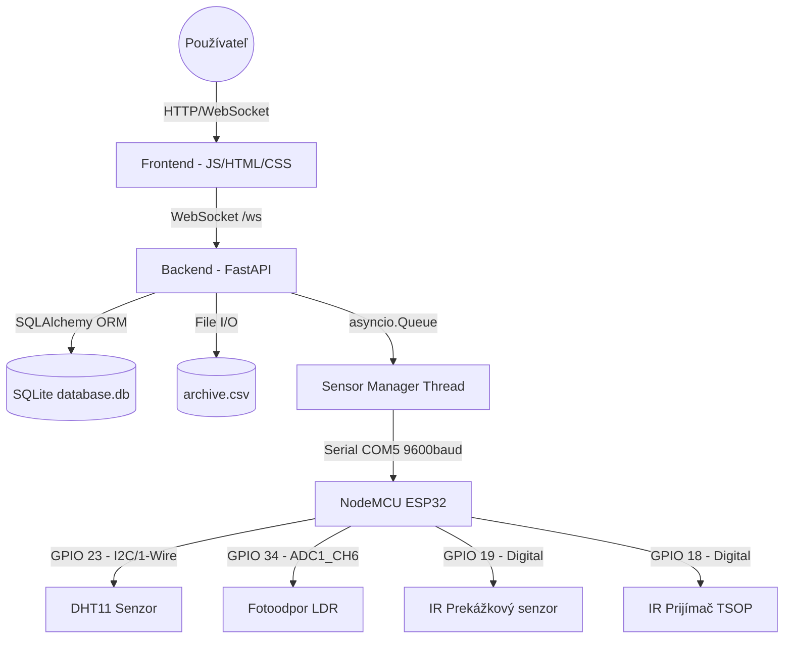
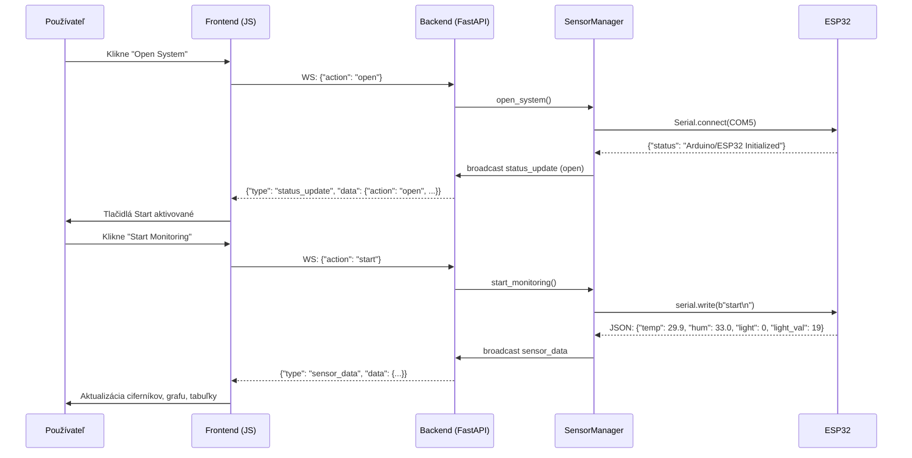

# Technická dokumentácia: IoT Control Center

**Predmet:** Monitorovanie a riadenie IoT systémov  
**Autor:** Michal Havryliuk  
**Verzia:** 2.0  
**Dátum:** 3. jún 2026  
**GitHub repozitár:** https://github.com/HavryliukM/POIT

---

## 1. Úvod a cieľ projektu

Cieľom projektu **IoT Control Center** je návrh a realizácia komplexnej webovej aplikácie pre real-time monitorovanie senzorických dát v prostredí IoT (Internet of Things). Systém je postavený na mikrokontroléri **NodeMCU ESP32**, ku ktorému sú pripojené reálne senzory — senzor teploty a vlhkosti **DHT11**, fotoodpor **LDR** na meranie intenzity osvetlenia, **IR prekážkový senzor** (MH-Sensor-Series) na detekciu mávnutia rukou a **IR prijímač (TSOP/VS1838)** na príjem signálov z telefónu alebo diaľkového ovládača.

Aplikácia plne spĺňa všetkých **10 bodov zadania** — od inicializácie (Open) cez start/stop monitorovania, zobrazovanie dát vo forme zoznamov, grafov a ciferníkov, archiváciu do databázy a CSV súboru, až po ukončenie (Close). Systém je navrhnutý podľa konceptu IoT, kde serverová časť (Python/FastAPI) zabezpečuje zber, reguláciu a archiváciu dát, zatiaľ čo klientska časť (HTML/CSS/JS) poskytuje interaktívny, vizuálne bohatý dashboard pre ovládanie a vizualizáciu.

---

## 2. Architektúra systému

### 2.1 Trojvrstvová architektúra

Systém je navrhnutý v troch hlavných vrstvách:

**1. Hardvérová vrstva (ESP32)**
- Riadiaci mikrokontrolér **NodeMCU ESP32** zbiera dáta z reálnych senzorov.
- Komunikuje s Python backendom cez **sériovú linku (Serial over USB)** vo formáte **JSON**.
- Implementuje debouncing pre IR prekážkový senzor (250 ms) a prijímanie IR signálov z diaľkového ovládača.

**2. Serverová vrstva (Backend)**
- Postavená na frameworku **FastAPI** (Python 3.x).
- Implementuje **WebSocket hub** pre real-time komunikáciu s viacerými klientmi.
- Riadi životný cyklus systému (Open/Close/Start/Stop).
- Archivuje dáta do **SQLite databázy** (cez SQLAlchemy ORM) a do **CSV súboru**.
- Spúšťa monitorovanie v samostatnom **démonickom vlákne** pre zachovanie responzivity servera.

**3. Prezentačná vrstva (Frontend)**
- Moderný **SPA dashboard** postavený na čistom HTML5, CSS3 a Vanilla JavaScript (ES6+).
- Využíva **Chart.js** pre kreslenie grafov s dual Y-osou.
- SVG-based **ciferníky (gauges)** s animovanými oblúkmi a glow efektami.
- **WebSocket klient** pre príjem real-time telemetrie bez obnovovania stránky.

### 2.2 UML Diagram komponentov



### 2.3 Sekvenčný diagram: Spustenie monitorovania



### 2.4 Schéma zapojenia senzorov (NodeMCU ESP32)

| Senzor | Pin senzora | GPIO (kód) | Označenie na doske | Poznámka |
|:---|:---|:---|:---|:---|
| **DHT11** | VCC | — | 3V3 | Napájanie 3.3V |
| | GND | — | GND | Spoločná zem |
| | DATA | **GPIO 23** | D23 | Digitálny dátový pin |
| **IR prekážkový** | VCC | — | 3V3 | Napájanie |
| | GND | — | GND | Spoločná zem |
| | D0 (Digital) | **GPIO 19** | D19 | LOW pri detekcii |
| **LDR fotoodpor** | Nožička 1 | — | 3V3 | Napájanie cez LDR |
| | Nožička 2 | **GPIO 34** | D34 / VP | ADC + 10kΩ rezistor na GND |
| **IR prijímač** | VCC | — | 3V3 | Napájanie |
| | GND | — | GND | Spoločná zem |
| | OUT / DATA | **GPIO 18** | D18 | Digitálny príjem IR |

> **Poznámka k fotoodporu (LDR):** Používa sa napäťový delič s 10 kΩ rezistorom. Čím viac svetla dopadá na LDR, tým nižší je jeho odpor a tým vyšší je analógový signál na GPIO 34 (hodnota 0–4095 na 12-bit ADC). Prahová hodnota pre detekciu priameho svetla je **2200**.

---

## 3. Komunikačný protokol

### 3.1 Serial komunikácia (ESP32 ↔ Python backend)

Komunikácia prebieha na rýchlosti **9600 baud**, každý riadok je valídny JSON objekt.

**ESP32 → Backend (senzorové dáta):**
```json
{"temp": 29.9, "hum": 33.0, "light": 0, "light_val": 19}
```

**ESP32 → Backend (IR udalosti):**
```json
{"action": "start", "trigger": "IR prekážkový senzor"}
{"action": "stop",  "trigger": "IR diaľkový ovládač"}
```

**Backend → ESP32 (príkazy):**
```
start\n
stop\n
```

### 3.2 WebSocket protokol (Frontend ↔ Backend)

**Klient → Server:**
```json
{"action": "open"}
{"action": "close"}
{"action": "start"}
{"action": "stop"}
{"action": "set_params", "interval": 1.5}
```

**Server → Klient (telemetria):**
```json
{
  "type": "sensor_data",
  "data": {
    "timestamp": "2026-06-03 22:04:57",
    "temp": 29.9,
    "hum": 33.0,
    "light": 0,
    "light_val": 19
  }
}
```

**Server → Klient (stav systému):**
```json
{
  "type": "status_update",
  "data": {
    "action": "stop",
    "message": "Monitoring stopped.",
    "trigger": "IR prekážkový senzor",
    "isRunning": false,
    "isOpen": true
  }
}
```

**Server → Klient (potvrdenie akcie):**
```json
{
  "type": "response",
  "data": {
    "status": "success",
    "message": "Monitoring started."
  }
}
```

---

## 4. Vývojárska príručka

### 4.1 Štruktúra projektu

```
Project11/
├── app.py                  # FastAPI server, WS endpoint, REST API
├── sensor_manager.py       # Logika monitorovania, vlákna, broadcast
├── models.py               # SQLAlchemy ORM model (SensorReading)
├── database.db             # SQLite databáza (automaticky vytvorená)
├── archive.csv             # CSV archív meraní
├── arduino_sketch/
│   └── arduino_sketch.ino  # Kód pre NodeMCU ESP32 (Arduino IDE)
├── static/
│   ├── css/
│   │   └── style.css       # Kompletný design systém (dark glassmorphism)
│   └── js/
│       └── main.js         # WebSocket klient, Chart.js, gauge logika
└── templates/
    └── index.html          # Jinja2 HTML šablóna
```

### 4.2 Popis súborov a tried

#### `app.py` — FastAPI server

Hlavný vstupný bod. Definuje:
- `GET /` — servíruje HTML dashboard.
- `GET /api/history` — REST endpoint, vracia posledných 50 záznamov z DB ako JSON.
- `WS /ws` — WebSocket endpoint. Pre každého klienta vytvorí `asyncio.Queue`. Spúšťa `push_loop` task, ktorý asynchrónne posiela dáta z frontu na klienta.

#### `sensor_manager.py` — SensorManager

Trieda riadi celý životný cyklus monitorovania:

| Metóda | Popis |
|:---|:---|
| `open_system()` | Inicializuje systém, pokúsi sa pripojiť k ESP32 cez Serial. |
| `close_system()` | Zastaví monitorovanie, uzavrie sériové spojenie. |
| `start_monitoring(trigger)` | Spustí vlákno pre simuláciu alebo odošle "start" na ESP32. |
| `stop_monitoring(trigger)` | Zastaví vlákno, odošle "stop" na ESP32, broadcastuje stav. |
| `set_interval(seconds)` | Nastaví frekvenciu meraní (min. 0.5s). |
| `_process_data(temp, hum, light, light_val)` | Archivuje do DB + CSV, broadcastuje na všetkých klientov. |
| `_serial_listener()` | Beží v démonickom vlákne, číta JSON riadky z ESP32. |
| `_simulator_worker()` | Simuluje merania ak ESP32 nie je dostupné. |
| `_broadcast_status(action, message, trigger)` | Posiela `status_update` správu všetkým klientom. |

**Mechanizmus multiklientského broadcastu:**  
Každý WebSocket klient dostane pri pripojení vlastnú `asyncio.Queue`. `SensorManager` ukladá dvojice `(queue, loop)` v thread-safe slovníku. Pri broadcastovaní pre každý front zavolá `loop.call_soon_threadsafe(q.put_nowait, payload)`, čo umožňuje z vlákna bezpečne vkladať dáta do asyncio event slučky.

#### `models.py` — Databázový model

SQLAlchemy ORM model `SensorReading` reprezentuje tabuľku `readings`:

| Stĺpec | Typ | Popis |
|:---|:---|:---|
| `id` | Integer (PK) | Primárny kľúč |
| `timestamp` | DateTime | Čas merania |
| `temp` | Float | Teplota (°C) |
| `hum` | Float | Vlhkosť (%) |
| `target_temp` | Float | Cieľová teplota (°C) |
| `actuator` | Integer | Stav akčného člena (0=OFF, 1=ON) |
| `light` | Integer | Priame svetlo (0=tieň, 1=priame) |
| `light_val` | Integer | Surová ADC hodnota LDR (0–4095) |
| `state` | String | Stav systému ("RUNNING") |

#### `arduino_sketch.ino` — ESP32 firmware

Kód implementuje v slučke `loop()`:
1. **Príjem príkazov cez Serial** (start/stop z backendu).
2. **IR prekážkový senzor** — debouncing 250ms, prepína stav meraní.
3. **IR prijímač (IRremote)** — pri akomkoľvek platnom IR kóde prepína stav meraní.
4. **Meranie a odosielanie** — každú sekundu prečíta DHT11 a ADC LDR, pošle JSON.

#### `static/js/main.js` — Frontend logika

- **WebSocket klient** s automatickým reconnect (každé 3 sekundy).
- **SVG Gauge** — animovaný oblúk pomocou `stroke-dasharray` (z 0 do 377 bodov zo 503 = 270°).
- **Chart.js dual Y-axis** — `yTemp` vľavo (°C), `yHum` vpravo (%), maximálne 30 bodov, automatický posun.
- **`loadHistory()`** — pri štarte načíta `/api/history` a naplní graf aj tabuľku.
- **IR trigger badge** — pri `status_update` s `trigger` zobrazí zdroj IR signálu.

### 4.3 Inštalácia a konfigurácia

**Závislosti (Python):**
```bash
pip install fastapi uvicorn sqlalchemy pyserial
```

**Arduino IDE knižnice (pre ESP32):**
- `DHT sensor library` (Adafruit)
- `IRremote` (Armin Joachimsmeyer, verzia 4.x)

**Konfigurácia portu:**  
V `sensor_manager.py`, riadok 18:
```python
def __init__(self, port="COM5", baudrate=9600):
```
Zmeňte `"COM5"` na skutočný port vášho ESP32 (napr. `"COM3"` na Windows, `"/dev/ttyUSB0"` na Linux).

**Spustenie:**
```bash
python app.py
```
Server beží na `http://0.0.0.0:5001`. Otvorte prehliadač na `http://127.0.0.1:5001`.

---

## 5. Plnenie požiadaviek zadania (10 bodov)

### Bod 1 — Open (inicializácia systému)

**Serverová časť:** Metóda `SensorManager.open_system()` nastaví `self.active = True`, pokúsi sa pripojiť k ESP32 cez `serial.Serial(COM5, 9600)` a spustí vlákno `_serial_listener`. Ak ESP32 nie je dostupné, systém prejde do **simulačného režimu** (automaticky generuje hodnoty).

**Klientská časť:** Tlačidlo `Open System` (id: `btn-open`) odošle WebSocket správu `{"action": "open"}`. Po potvrdení zo servera sa aktivujú tlačidlá `Start Monitoring` a `Close System`. Status badge v hlavičke zobrazí "Systém pripravený".

---

### Bod 2 — Nastavenie parametrov

**Serverová časť:** Metóda `SensorManager.set_interval(seconds)` nastaví `self.interval` (minimálne 0.5s). Hodnota sa uplatní v `_simulator_worker` (delay) aj na ESP32 strane (interval merania je nastavený v `measurementInterval` v Arduino kóde).

**Klientská časť:** Vstupné pole `Perióda merania (s)` (id: `interval`) s tlačidlom `Nastaviť` (id: `btn-set`) odošle `{"action": "set_params", "interval": 1.5}`.

---

### Bod 3 — Start (spustenie monitorovania)

**Serverová časť:** `SensorManager.start_monitoring(trigger)` skontroluje, či je systém otvorený (`self.active`) a či ešte nebeží (`self.running`). Nastaví `self.running = True`. V hardvérovom režime odošle `b"start\n"` na ESP32. V simulačnom režime spustí démonické vlákno `_simulator_worker`.

**Klientská časť:** Tlačidlo `Start Monitoring` (id: `btn-start`) pošle `{"action": "start"}`. Stav sa aktualizuje cez `status_update` správu — status badge zmení na "Monitorovanie aktívne" s pulzujúcou modrou bodkou.

---

### Bod 4 — Výpis dát vo forme zoznamu

**Serverová časť:** `_process_data()` broadcastuje každé meranie na všetkých klientov cez WebSocket (`type: sensor_data`).

**Klientská časť:** Funkcia `addHistoryRow(ts, temp, hum, light)` vkladá nový riadok do HTML tabuľky `#history-table` vždy navrch (insertRow(0)). Tabuľka drží maximálne 50 posledných záznamov. Zobrazuje: čas, teplotu (°C), vlhkosť (%), stav svetla (☀️ Priame / 🌑 Tieň). Pri štarte stránky sa tabuľka automaticky naplní z REST API `/api/history` (funkcia `loadHistory()`).

---

### Bod 5 — Zobrazovanie vo forme grafov

**Serverová časť:** Dáta sú broadcastované v reálnom čase cez WebSocket.

**Klientská časť:** Graf je implementovaný pomocou **Chart.js** s konfigurácou `type: 'line'` a dvoma datasetmi:
- **Teplota (°C)** — oranžová čiara, `yAxisID: 'yTemp'` (ľavá Y-os, rozsah 15–40°C).
- **Vlhkosť (%)** — modrá čiara, `yAxisID: 'yHum'` (pravá Y-os, rozsah 20–80%).

Graf zobrazuje maximálne 30 posledných meraní s automatickým posuvom. Tooltip pri hoveri zobrazuje hodnoty z oboch ôs naraz. Funkcia `loadHistory()` pre-naplní graf historickými dátami z DB.

---

### Bod 6 — Zobrazovanie vo forme ciferníkov (gauges)

**Klientská časť:** Dva SVG ciferníky sú implementované pomocou **animovaných oblúkov** (`stroke-dasharray`):

- **Teplota** (0–50°C) — oranžová-žltá paleta s glow filtrom (`feGaussianBlur`).
- **Vlhkosť** (0–100%) — modrá paleta s glow filtrom.

Funkcia `setGauge(arcEl, valEl, badgeEl, value, min, max, unit)` vypočíta percento hodnoty a nastaví `stroke-dasharray` na hodnotu `pct × 377` (čo zodpovedá 270° oblúku). Prechod je animovaný CSS `transition: stroke-dasharray 0.9s cubic-bezier(...)`. Každá karta má hover efekt (`translateY(-4px)`) a radial gradient pozadie.

---

### Bod 7 — Archivácia do databázy + výpis a vykreslenie

**Serverová časť:** `_process_data()` pre každé meranie vytvorí záznam `SensorReading` a uloží ho do SQLite cez SQLAlchemy session. REST endpoint `GET /api/history` vráti posledných 50 záznamov zotriedených zostupne podľa času ako JSON.

**Klientská časť:** `loadHistory()` zavolá `/api/history` pri načítaní stránky a naplní graf aj tabuľku. Tým je splnená požiadavka na **výpis** (tabuľka) a **vykreslenie** (graf) archivovaných dát.

---

### Bod 8 — Archivácia do súboru (CSV) + výpis a vykreslenie

**Serverová časť:** `_process_data()` zapisuje každé meranie do `archive.csv` (mode `append`). Hlavička CSV: `timestamp, temp, hum, target_temp, actuator, light, light_val, state`. Ak súbor neexistuje, vytvorí sa automaticky pri štarte.

**Vizualizácia:** Rovnaká tabuľka a graf na dashboarde zobrazujú dáta zo DB, ktorá je synchrónne naplnená zo sériovej linky — to zahŕňa aj obsah z CSV (každý riadok v CSV zodpovedá záznamu v DB).

---

### Bod 9 — Stop (zastavenie monitorovania)

**Serverová časť:** `stop_monitoring(trigger)` nastaví `self.running = False`. V hardvérovom režime odošle `b"stop\n"` na ESP32. Broadcastuje `status_update` so `trigger` parametrom, ktorý identifikuje zdroj (web UI / IR prekážkový senzor / IR diaľkový ovládač).

**Klientská časť:** Tlačidlo `Stop Monitoring` (id: `btn-stop`) pošle `{"action": "stop"}`. Pri príjme `status_update` s `action: "stop"` a `trigger` nastaveným na IR senzor sa status badge zmení na "Zastavené cez IR prekážkový senzor" s červenou pulzujúcou bodkou (`dot--stopped-ir`). IR badge v informačnej karte sa aktualizuje na "■ STOP — IR prekážkový senzor".

---

### Bod 10 — Close (ukončenie, deaktivácia)

**Serverová časť:** `close_system()` zavolá `stop_monitoring()`, nastaví `self.active = False` a uzavrie sériové spojenie `self.arduino.close()`. Broadcastuje `status_update (action: close)`.

**Klientská časť:** Tlačidlo `Close System` (id: `btn-close`) pošle `{"action": "close"}`. Po potvrdení sa deaktivujú všetky ovládacie tlačidlá okrem `Open System`. Status badge sa vráti do stavu "Odpojené".

---

## 6. Bezpečnosť a robustnosť

- **Automatický reconnect WebSocket**: Klient sa automaticky pokúša o opätovné pripojenie každé 3 sekundy pri výpadku.
- **Fallback simulácia**: Ak sa systém nevie pripojiť k ESP32 (napr. nie je zapojené), automaticky prejde do simulačného režimu — aplikácia ostáva plne funkčná.
- **Chybové stavy senzorov**: Ak DHT11 vráti `NaN`, ESP32 odošle `{"error": "Failed to read from DHT sensor!"}` a Python backend tento riadok ignoruje.
- **Thread-safe broadcast**: Použitie `threading.Lock()` pre ochranu `_clients` slovníka.
- **Debouncing IR senzora**: 250 ms ochranná lehota zabraňuje viacnásobným triggerom.

---

## 7. Používateľská príručka

### 7.1 Inštalácia a spustenie

1. **Predpoklady**: Python 3.8+, nainštalované knižnice.
2. **Inštalácia závislostí**:
   ```bash
   pip install fastapi uvicorn sqlalchemy pyserial
   ```
3. **(Voliteľné) Nahratie Arduino kódu**: Otvorte `arduino_sketch/arduino_sketch.ino` v Arduino IDE, nainštalujte knižnice DHT a IRremote, zvoľte port a nahrajte kód na ESP32.
4. **Spustenie servera**:
   ```bash
   python app.py
   ```
5. **Otvorenie dashboardu**: Prejdite na `http://127.0.0.1:5001` v ľubovoľnom modernom prehliadači.

### 7.2 Popis ovládacích prvkov

| Tlačidlo | Funkcia |
|:---|:---|
| **Open System** | Inicializuje systém a spojenie s ESP32. Musí byť stlačené ako prvé. |
| **Close System** | Zastaví monitorovanie a deaktivuje celý systém. |
| **Start Monitoring** | Spustí nepretržité meranie a odosielanie dát. |
| **Stop Monitoring** | Pozastaví meranie (systém ostáva otvorený). |
| **Perióda merania / Nastaviť** | Nastaví interval merania v sekundách (min. 0.5s). |

### 7.3 Vizuálne indikátory

| Indikátor | Popis |
|:---|:---|
| **Status badge (vpravo hore)** | "Odpojené" (sivá), "Systém pripravený" (zelená), "Monitorovanie aktívne" (modrá, pulzuje), "Zastavené cez IR" (červená, pulzuje). |
| **Ciferník Teplota** | Animovaný SVG oblúk, zobrazuje aktuálnu hodnotu v °C (0–50). |
| **Ciferník Vlhkosť** | Animovaný SVG oblúk, zobrazuje aktuálnu hodnotu v % (0–100). |
| **Osvetlenie (info karta)** | Bodka + text — "Tieň" (sivá) alebo "Priame svetlo" (žltá, svieti). |
| **LDR hodnota** | Surová hodnota z analógového vstupu ESP32 (0–4095). |
| **IR ovládanie badge** | "Žiadny signál" (sivá), "▶ START — [zdroj]" (zelená), "■ STOP — [zdroj]" (červená). |
| **Systémový log** | Chronologický výpis udalostí (zelená=start, červená=stop, žltá=IR). |
| **Graf** | Dual Y-axis: teplota (oranžová, °C) vľavo, vlhkosť (modrá, %) vpravo. |
| **Tabuľka hodnôt** | Posledných 50 meraní z DB, automaticky obnovovaná. |

### 7.4 Ovládanie pomocou IR senzorov

- **Mávnutie rukou** pred IR prekážkovým senzorom (MH-Sensor-Series): prepína stav monitorovania (start ↔ stop).
- **IR signál z telefónu** (s IR blasterom) alebo **z diaľkového ovládača**: ľubovoľný platný IR kód prepne stav monitorovania.
- Pri IR triggerovaní sa zmena okamžite prejaví v UI — status badge, systémový log aj IR badge sa aktualizujú.

---

## 8. Záver

Projekt **IoT Control Center** je plne funkčná webová IoT aplikácia, ktorá spĺňa všetkých **10 bodov** zadania. Využíva reálny hardvér (NodeMCU ESP32 s DHT11, LDR, IR prekážkovým senzorom a IR prijímačom) a moderný technologický stack (FastAPI, WebSockets, Chart.js, SVG gauges). Systém je navrhnutý s dôrazom na:

- **Robustnosť** — automatický fallback do simulačného režimu, reconnect, debouncing.
- **Real-time komunikáciu** — WebSocket pre minimálnu latenciu.
- **Plnú archivačnú vrstvu** — súbežne SQLite databáza aj CSV súbor.
- **Premium UX** — dark glassmorphism design, animované ciferníky, dual Y-axis graf.
- **IR integráciu** — fyzické ovládanie monitorovania mávnutím ruky alebo diaľkovým ovládačom s okamžitou odozvou v UI.

---

## Príloha: Screenshoty systému

### Screenshot 1: Úvodný stav (po načítaní histórie z DB)

Ciferníky zobrazujú posledné hodnoty z databázy, tabuľka a graf sú pre-naplnené historickými dátami. Systém čaká na príkaz Open.

### Screenshot 2: Monitorovanie aktívne

Status badge "Monitorovanie aktívne" s pulzujúcou modrou bodkou. Graf sa v reálnom čase rozširuje o nové hodnoty, ciferníky sa animovane aktualizujú.

### Screenshot 3: Zastavenie cez IR senzor

Po mávnutí rukou alebo výslaní IR signálu: status badge "Zastavené cez IR prekážkový senzor" s červenou pulzujúcou bodkou, IR badge zobrazuje "■ STOP — IR prekážkový senzor".
