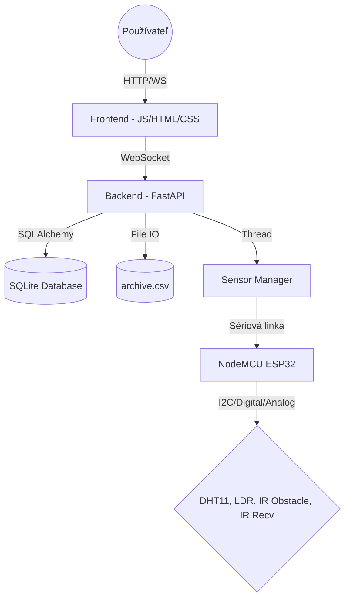

# Technická dokumentácia: IoT Control Center

**Predmet:** Monitorovanie a riadenie IoT systémov  
**Autor:** [Vaše Meno]  
**Verzia:** 1.0  
**Dátum:** 28. apríl 2026

---

## 1. Úvod
Cieľom tohto projektu je návrh a realizácia webovej aplikácie pre real-time monitorovanie senzorických dát (teplota a vlhkosť). Systém je navrhnutý podľa konceptu IoT (Internet of Things), kde serverová časť zabezpečuje zber a archiváciu dát a klientska časť poskytuje intuitívne rozhranie pre vizualizáciu a ovládanie.

## 2. Architektúra systému

### 2.1 Koncepčný návrh
Systém pozostáva z troch hlavných vrstiev:
1.  **Hardvérová vrstva (ESP32):** Riadiaci mikrokontrolér NodeMCU ESP32, ktorý zhromažďuje dáta z reálnych senzorov a odosiela ich cez sériovú linku (Serial over USB) vo formáte JSON do backendu.
    *   **DHT11** (Senzor teploty a vlhkosti) - pin **GPIO 23**
    *   **Fotoodpor LDR** (Svetelný senzor pre detekciu priameho svetla s 10kΩ rezistorom) - pin **GPIO 34 (ADC1_CH6)**
    *   **IR prekážkový senzor (MH-Sensor-Series)** (Detekcia mávnutia rukou) - pin **GPIO 19**
    *   **IR Prijímač (TSOP)** (Príjem signálu pre zapnutie/vypnutie z telefónu) - pin **GPIO 18**
2.  **Serverová vrstva (Backend):** Postavená na frameworku **FastAPI**. Implementuje riadiacu slučku (termostat), spracováva príkazy a dáta prijaté z ESP32 a ukladá ich do SQLite databázy a CSV súboru.
3.  **Prezentačná vrstva (Frontend):** Moderný responzívny dashboard využívajúci Vanilla JS, Chart.js pre grafy, Canvas-Gauges pre ciferníky a vlastný vizuálny indikátor intenzity svetla.

### 2.2 UML Diagram komponentov

### 2.3 Komunikačný protokol (WebSocket)
Komunikácia prebieha v reálnom čase pomocou JSON správ:
-   **Klient -> Server:**
    -   `{"action": "open"}`: Inicializácia systému.
    -   `{"action": "start"}`: Spustenie monitorovania.
    -   `{"action": "set_params", "interval": 1.0}`: Nastavenie frekvencie odberu.
-   **Server -> Klient:**
    -   `{"type": "sensor_data", "data": {...}}`: Telemetrické údaje.
    -   `{"type": "response", "data": {...}}`: Potvrdenia o vykonaní akcií.

---

## 3. Vývojárska príručka

### 3.1 Štruktúra projektu
-   `app.py`: Hlavný vstupný bod aplikácie, definícia endpointov a WebSocket logiky.
-   `sensor_manager.py`: Logika riadenia vlákien a simulácie dát.
-   `models.py`: Definícia databázových modelov (SQLAlchemy).
-   `static/js/main.js`: Klientska logika, spracovanie WS správ a renderovanie grafov.
-   `static/css/style.css`: Moderný dizajn (Glassmorphism).

### 3.2 Databázová schéma
Použitá je databáza SQLite. Tabuľka `readings` obsahuje:
-   `id` (Integer): Primárny kľúč.
-   `timestamp` (DateTime): Čas merania.
-   `temp` (Float): Hodnota teploty.
-   `hum` (Float): Hodnota vlhkosti.
-   `target_temp` (Float): Nastavená cieľová teplota.
-   `actuator` (Integer): Stav chladenia (0 = OFF, 1 = ON).
-   `light` (Integer): Stav osvetlenia (0 = tieň, 1 = priame svetlo).
-   `light_val` (Integer): Analógová hodnota z fotoodporu (0 - 4095).
-   `state` (String): Stav systému (RUNNING).

### 3.3 Implementácia multithreadingu
Pre zachovanie responzivity servera je monitorovanie realizované v samostatnom démonickom vlákne (`threading.Thread`). Dáta sú následne distribuované pripojeným klientom pomocou asynchrónnych frontov (`asyncio.Queue`), čo zabraňuje blokovaniu hlavnej event slučky.

---

## 4. Používateľská príručka

### 4.1 Inštalácia a spustenie
1.  Nainštalujte potrebné knižnice: `pip install fastapi uvicorn sqlalchemy`.
2.  Spustite server: `python app.py`.
3.  Otvorte prehliadač na adrese `http://127.0.0.1:5001`.

### 4.2 Popis rozhrania
-   **System Commands:** Obsahuje tlačidlá pre ovládanie životného cyklu aplikácie.
    -   *Open System*: Musí sa stlačiť ako prvé pre aktiváciu systému.
    -   *Start Monitoring*: Spustí tok dát.
-   **Live Telemetry:** Ciferníky zobrazujúce okamžitú hodnotu teploty (°C) a vlhkosti (%).
-   **Regulation Controls:** Posuvník pre nastavenie cieľovej teploty (Target Temp). Systém automaticky aktivuje chladenie, ak teplota prekročí tento limit o viac ako 0.5°C.
-   **Cooling Indicator:** Vizuálna signalizácia stavu akčného člena (Active/Idle).
-   **Real-time Trends:** Lineárny graf zobrazujúci posledných 20 meraní s automatickým posuvom.
-   **Archived Readings:** Tabuľka s históriou meraní vrátane stavu akčného člena v čase zápisu.

### 4.3 Nastavenie parametrov
V poli "Refresh Rate (s)" môže používateľ definovať, ako často sa majú dáta generovať a ukladať. Minimálna hodnota je 0.5 sekundy pre zachovanie stability systému.

---

## 5. Záver
Aplikácia IoT Control Center plne spĺňa všetky body zadania. Vďaka použitiu moderných technológií ako FastAPI a WebSockets je systém vysoko stabilný a schopný spracovávať dáta v reálnom čase s minimálnou latenciou. Robustný mechanizmus archivácie do DB aj CSV zabezpečuje integritu dát pre ďalšiu analýzu.

---

### Príloha: Screenshoty systému

*(Tu do finálneho dokumentu vložte obrázky, ktoré som vám vygeneroval v predchádzajúcich krokoch)*
- **Obrázok 1:** Dashboard v stave monitorovania.
- **Obrázok 2:** Ukážka grafov a ciferníkov.
- **Obrázok 3:** Výpis logov a histórie meraní.
